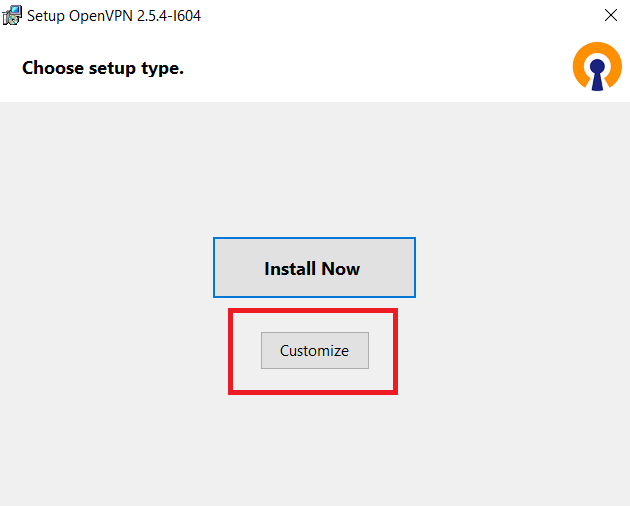
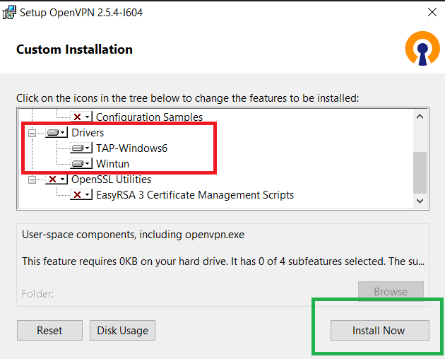
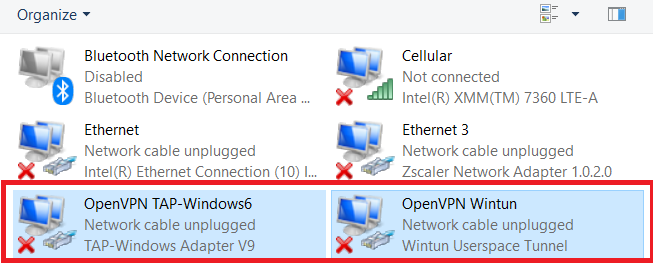
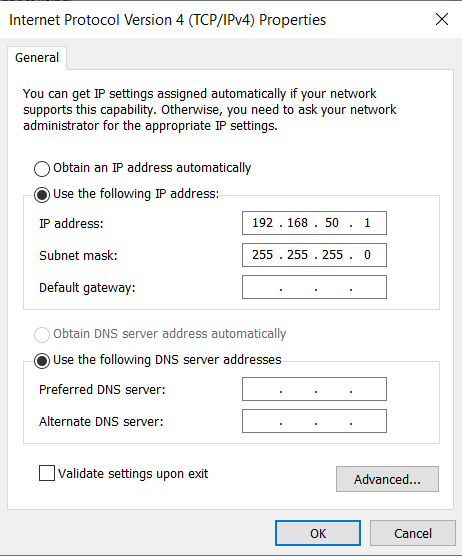

# QEMU Configuring Network Settings

## Contents
- [Overview](#overview)
- [Qemu Network Settings on Windows Host](#qemu-network-settings-on-windows-host)
- [Qemu Network Settings on Linux Host](#qemu-network-settings-on-linux-host)

# Overview
&ensp;&ensp;QEMU has several different modes of networking. Some of them are "User Mode", "Socket Redirection" and "TAP networking". If no network options are specified, QEMU will default to emulating a single Intel e1000 PCI card with a user-mode network stack that bridges to the host's network.  By default, however, it acts as a firewall and does not permit any incoming traffic. It also doesn't support protocols other than TCP and UDP - so, for example, ping and other ICMP utilities won't work. 

&ensp;&ensp;To allow network connections to the guest OS under user mode networking, you can redirect a port on the host OS to a port on the guest OS. This method called "Socket Redirection". This is useful for supporting file sharing, web servers and SSH servers from the guest OS. Disadvantage of this method is that the emulator's all necessary ports must be configured manually.

&ensp;&ensp;QEMU can use TAP interfaces to provide full networking capability for the guest OS. If you want strict control of your IP addressing and routing, use this "TAP Network" mode. This document covers how to setup TAP Network for Qemu on both Linux and Windows host machines.

# Qemu Network Settings on Windows Host
&ensp;&ensp; On Windows host, you need to create virtual TAP Network Adapter with third party applications. We will use OpenVPN Tap Network Driver for the purpose. You can use another application. OpenVPN Package can be downloaded with the link below:
https://openvpn.net/community-downloads/

Before Install, installer must be configured with "Configure" Button. We don't need whole OpenVPN package. Just install Network drivers.

After installation completed, 2 new virtual network adapters will be installed.

For convenience, the adapter OpenVPN TAP-Windows6 can be renamed to "tap0" by pressing F2. Static IP must be assigned to the tap0 interface.

Host-side configuration is now completed. Next step is to open Qemu emulator with this tap0 network interface. This can be done with following line of arguments : 

> -net nic -net tap,ifname=tap0,script=no

After emulator started, desired IP address can be given like below:

# Qemu Network Settings on Linux Host
On Linux host, the settings are basicaly the same. You don't need 3rd party applications to create TAP interface. We will configure TAP adapter with command line. First, we need to create TAP network adapter. This can be done with following command: 

> sudo ip tuntap add mode tap tap0

After tap0 network interface created, static IP must be assigned to this adapter.

> sudo ip addr add 192.168.50.1/24 dev tap0

> sudo ip link set tap0 up

The following steps are the same as Windows host.
Next step is to open Qemu emulator with this tap0 network interface. This can be done with following line of arguments :

> -net nic -net tap,ifname=tap0,script=no

After emulator started, desired IP address can be given like below:

